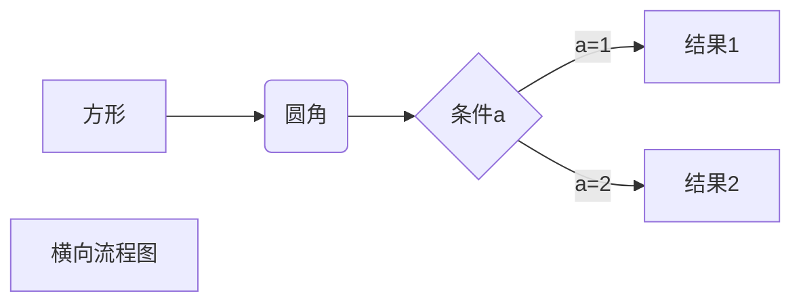
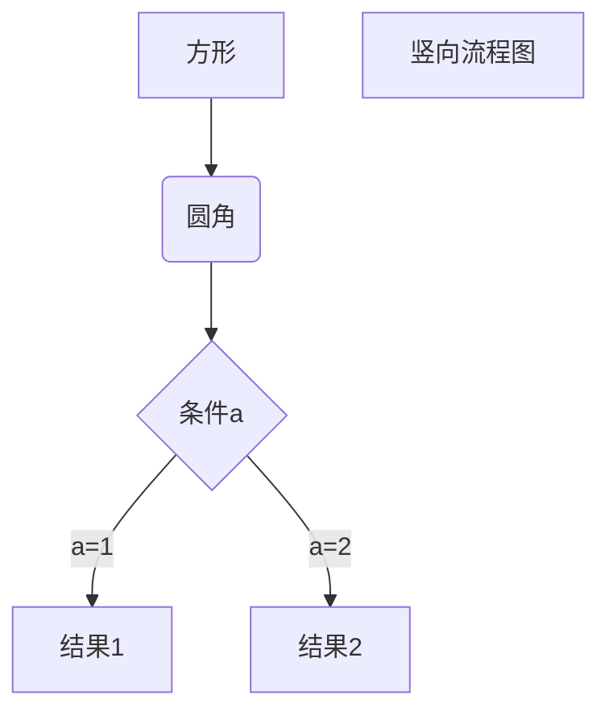
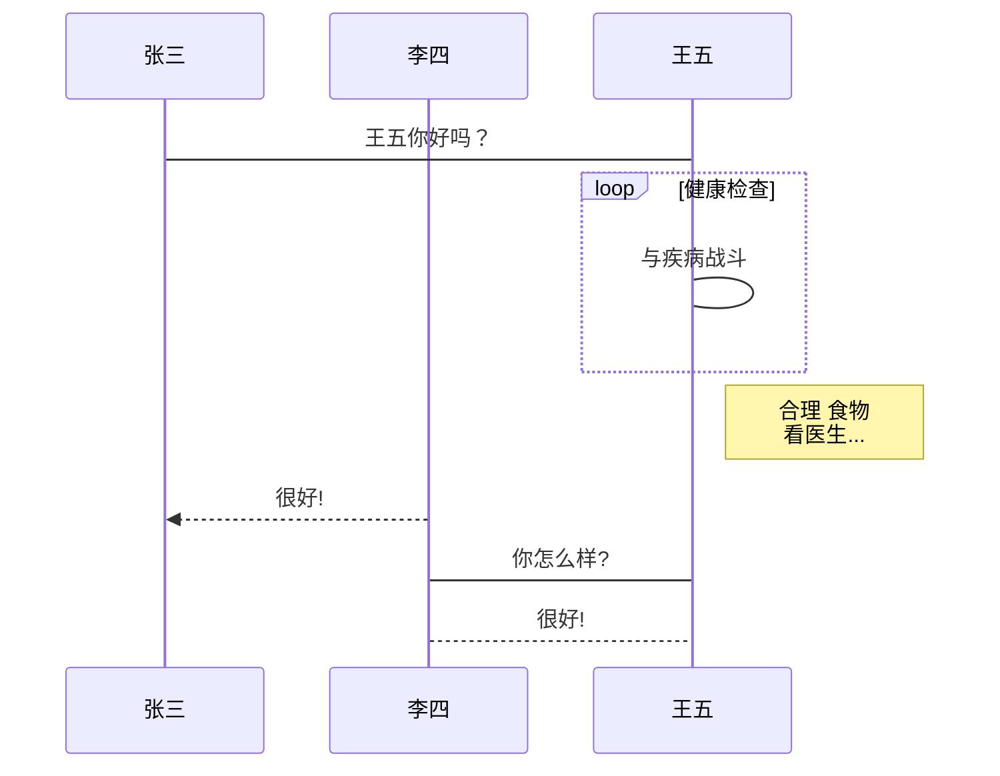
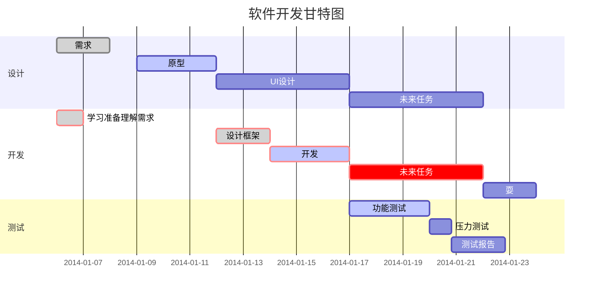

# Markdown 教程
## 来源: https://www.runoob.com/markdown/md-tutorial.html
## 高级效果在Typora中可以展现出来.

## 1 标题类

   # 一级标题
   ## 二级标题
   ### 三级标题
   #### 四级标题
   ##### 五级标题
   ###### 六级标题

   一级标题(标题下加下划线用=)
   =======================

   二级标题(标题下加下划线用-)
   -----------------------

## 2 段落
###### Markdown 段落没有特殊的格式, 直接编写文字就好, 段落的换行是使用两个以上空格或者回车.
   用两个空格:  
   RUNOOB.COM  
   GOOGLE.COM  

   用回车:  
   RUNOOB.COM
       
   GOOGLE.COM

## 3 字体
   *斜体文本*

   _斜体文本_

   **粗体文本**

   __粗体文本__

   ***粗斜体文本***

   ___粗斜体文本___


## 4 列表
###### 无序列表使用星号(*), 加号(+)或减号(-)作为列表标记, 这些标记后面要添加一个空格, 然后再填写内容.
* 第一项
* 第二项
* 第三项

+ 第一项
+ 第二项
+ 第三项

- 第一项
- 第二项
- 第三项

* 第一项
+ 第二项
- 第三项

### 4.1 列表嵌套
###### 列表嵌套只需在子列表中的选项前面添加四个空格和-即可(最多三级).
#### 4.1.1 嵌套无序:
* 第一项第一级
    - 第一项第二级
        - 第一项第三级

+ 第二项第一级
    - 第二项第二级
        - 第二项第三级

- 第三项第一级
   - 第三项第二级
       - 第三项第三级

#### 4.1.2 嵌套有序
1. 第一项第一级
   1. 第一项第二级
   2. 第一项第二级
      1. 第一项第三级
      2. 第一项第三级
         
## 5 区块
###### Markdown 区块引用是在段落开头使用 > 符号, 然后后面紧跟一个空格符号.
###### 正确情况下显示时源文档段落会显示为绿色, 区块中不会显示 >符号. 
> 区块引用  
> 菜鸟教程  
> 学的不仅是技术更是梦想

> 最外层
> > 第一层嵌套
> >
> > > 第二层嵌套

> 区块中使用列表
> 1. 第一项
> 2. 第二项
> + 第一项
> + 第二项

* 列表中使用区块
* 第一项
  > 菜鸟教程  
  > 学的不仅是技术更是梦想  
* 第二项

## 6 代码
### 6.1 如果是段落上的一个函数或片段的代码可以用反引号`把它包起来
`printf()` 函数

### 6.2 代码区块使用 4 个空格或者一个制表符(Tab 键)
    $(document).ready(function () {
        alert('RUNOOB');
    });

### 6.3 你也可以用 ``` 包裹一段代码, 并指定一种语言(也可以不指定)
```java
public class HelloWorld {
    //  public static void main 是万年不变的固定写法, 代表main方法
    public static void main(String[] args) {
        System.out.println("HelloWorld!");
    }
}
```

## 7 链接
语法1: `[链接名称](链接地址)`  
语法2: `<链接地址>`  

示例1: [菜鸟教程](https://www.runoob.com)  
示例2: <https://www.runoob.com>   

### 7.1 高级链接
###### 我们可以通过变量来设置一个链接, 变量赋值在文档末尾进行.
这个链接用 1 作为网址变量 [Google][1]   
这个链接用 runoob 作为网址变量(runoob无视大小写) [Runoob][runoob]   
然后在文档的结尾为变量赋值(网址)    

[1]: http://www.google.com/
[runoob]: http://www.runoob.com/

## 8 图片
语法1: ``   
语法2: ``   

  
  
  

#### 示例1
这个链接用 1 作为网址变量  
![RUNOOB][2]  
然后在文档的结尾为变量赋值(网址)   

[2]: http://static.runoob.com/images/runoob-logo.png

#### 示例2
这个链接用 RUNOOB 作为网址变量  
![RUNOOB][AAA]  
然后在文档的结尾为变量赋值(网址)

[aaa]: http://static.runoob.com/images/runoob-logo.png

### 8.1 img标签
###### Markdown 还没有办法指定图片的高度与宽度, 如果你需要的话, 你可以使用普通的  标签.


## 9  表格
###### Markdown 制作表格使用 | 来分隔不同的单元格, 使用 - 来分隔表头和其他行.
|  表头   | 表头  |
|  ----  | ----  |
| 单元格  | 单元格 |
| 单元格  | 单元格 |

###### 对齐方式
    -: 设置内容和标题栏居右对齐;
    :- 设置内容和标题栏居左对齐;
    :-: 设置内容和标题栏居中对齐.

| 左对齐 | 右对齐 | 居中对齐 |
| :-----| ----: | :----: |
| 单元格 | 单元格 | 单元格 |
| 单元格 | 单元格 | 单元格 |

## 10 高级技巧
### 10.1 支持的 HTML 元素
###### 不在 Markdown 涵盖范围之内的标签, 都可以直接在文档里面用 HTML 撰写.
###### 目前支持的 HTML 元素有: `<kbd>`, `<b>`,  `<i>`, `<em>`, `<sup>`, `<sub>`, `<br>`等.
示例: 使用<kbd>Ctrl</kbd>+<kbd>Alt</kbd>+<kbd>Del</kbd> 重启电脑

### 10.2 转义
###### Markdown 使用了很多特殊符号来表示特定的意义, 如果需要显示特定的符号则需要使用转义字符, Markdown 使用反斜杠 \ 转义特殊字符.
**文本加粗** 
\*\* 正常显示星号 \*\*

\\   反斜线
\`   反引号
\*   星号
\_   下划线
\{\}  花括号
\[\]  方括号
\(\)  小括号
\#   井字号
\+   加号
\-   减号
\.   英文句点
\!   感叹号


## 11 公式
###### 当你需要在编辑器中插入数学公式时, 可以使用两个美元符 $$ 包裹 TeX 或 LaTeX 格式的数学公式来实现. 提交后, 问答和文章页会根据需要加载 Mathjax 对数学公式进行渲染.
##### 示例

$$
\mathbf{V}_1 \times \mathbf{V}_2 =  \begin{vmatrix}  
\mathbf{i} & \mathbf{j} & \mathbf{k} \\  
\frac{\partial X}{\partial u} &  \frac{\partial Y}{\partial u} & 0 \\  
\frac{\partial X}{\partial v} &  \frac{\partial Y}{\partial v} & 0 \\  
\end{vmatrix}  
${$tep1}{\style{visibility:hidden}{(x+1)(x+1)}}
$$


## 12. 其他
### 12.1 横向流程图源码格式:


### 12.2 竖向流程图源码格式:


### 12.3、标准流程图源码格式:
```flow
st=>start: 开始框
op=>operation: 处理框
cond=>condition: 判断框(是或否?)
sub1=>subroutine: 子流程
io=>inputoutput: 输入输出框
e=>end: 结束框
st->op->cond
cond(yes)->io->e
cond(no)->sub1(right)->op
```

### 12.4 标准流程图源码格式(横向):
```flow
st=>start: 开始框
op=>operation: 处理框
cond=>condition: 判断框(是或否?)
sub1=>subroutine: 子流程
io=>inputoutput: 输入输出框
e=>end: 结束框
st(right)->op(right)->cond
cond(yes)->io(bottom)->e
cond(no)->sub1(right)->op
```

### 12.5 UML时序图源码样例:
```sequence
对象A->对象B: 对象B你好吗?（请求）
Note right of 对象B: 对象B的描述
Note left of 对象A: 对象A的描述(提示)
对象B-->对象A: 我很好(响应)
对象A->对象B: 你真的好吗？
```

### 12.6 UML时序图源码复杂样例:
```sequence
Title: 标题：复杂使用
对象A->对象B: 对象B你好吗?（请求）
Note right of 对象B: 对象B的描述
Note left of 对象A: 对象A的描述(提示)
对象B-->对象A: 我很好(响应)
对象B->小三: 你好吗
小三-->>对象A: 对象B找我了
对象A->对象B: 你真的好吗？
Note over 小三,对象B: 我们是朋友
participant C
Note right of C: 没人陪我玩
```

### 12.7 UML标准时序图样例:


### 12.8 甘特图样例:
